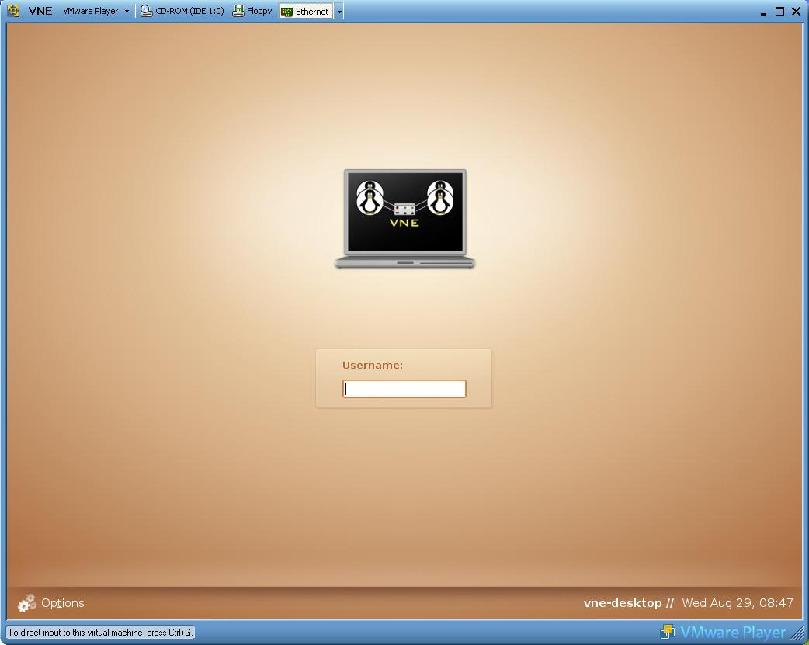
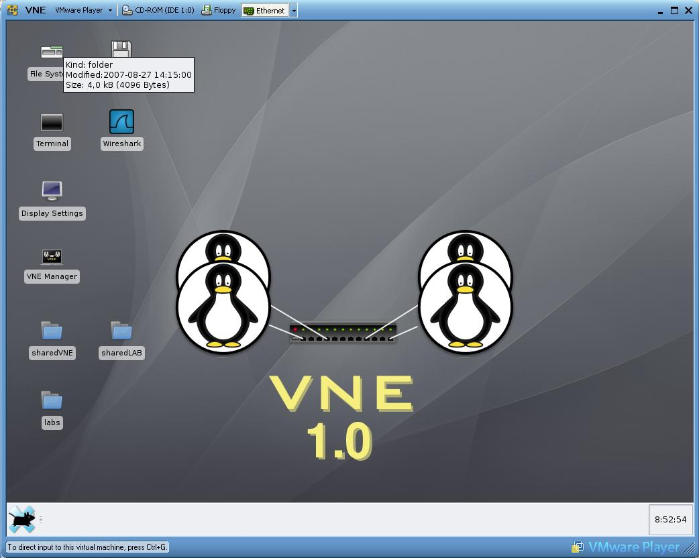
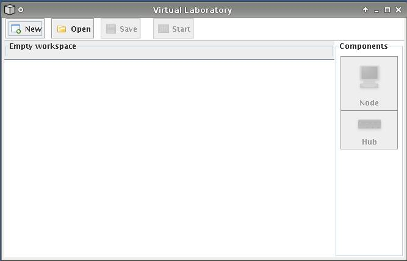
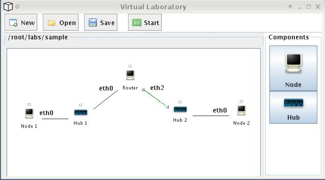
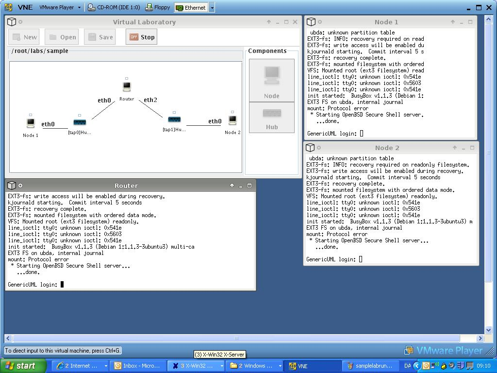
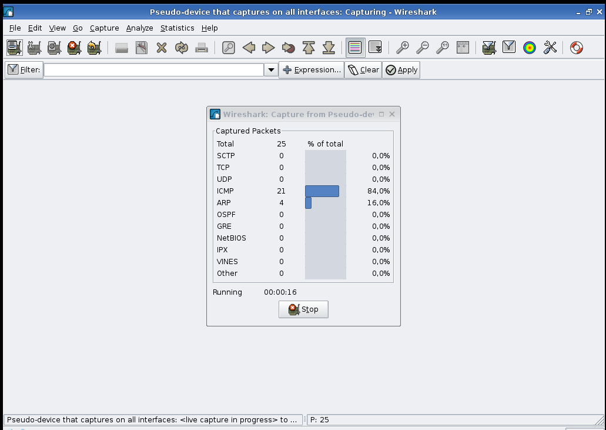

## VINE: Virtual TCP/IP Networking Environment

### Introduction

The Virtual TCP/IP Networking Environment is a linux-based virtual environment intended for practical lab-exercises in relation to teaching TCP/IP networking. The VINE environment makes it possible to organise workshops in a course related to configuration of smaller TCP/IP networks. Such workshop will make it possible to conduct practical experiments with the TCP/IP concepts and protocols introduced in the lectures

VINE provides a virtual laboratory facilities to experiment with IP networking in the context of the Linux operating system. VINE runs on a single PC (Linux/Windows/Mac OS) and makes it possible to create and run virtual laboratories of Linux machines connected by virtual hubs.

VINE consists of the following components:

- The **VNE virtual machine** implemented as a virtual Ubuntu Linux machine for [VMware Player](https://www.vmware.com/products/workstation-player/workstation-player-evaluation.html).

- The **VNE Manager** application which is a graphical front-end for creating and running virtual laboratories.

- **Virtual laboratories** running inside the VNE virtual machine and implemented as virtual hubs and virtual Linux machines in [User Mode Linux](http://user-mode-linux.sourceforge.net/).


### Installation

Installation of VNE consists of three steps:

1. Download and install [VMware Player](https://www.vmware.com/products/workstation-player/workstation-player-evaluation.html)

- Download [VINE](https://www.dropbox.com/s/9uw13i53zwkueu3/VINE-1.0.exe?dl=0) or [VNE](https://www.dropbox.com/s/sufvve0av4qfu5p/VNE-1.0.exe?dl=0) (~500 Mb) which is the VNE virtual machine for WMware Player.

- Unpack the archive downloaded in step 2. The archive is self-extracting on the Windows platform. It is unpacked using [7-zip](http://www.7-zip.org/) on the Linux platform. VNE is extracted in a directory named `VNE-[version]`

### Starting and Stopping VNE</h2></a>

To start VNE, double-click on the *VNE* VMware Configuration File in the directory where VNE was extracted. This will launch VMware Player. The first time VNE is started, select <i>Create</i> when prompted for creation of a new unique identifier (UUID) for the virtual machine.

After a while the VNE login screen will appear



It is now possible to login to the VNE environment using:

```
username: root
password: root
```

After the login the VNE desktop will appear



The display of the VNE virtual machine has been configured to a resolution of 1024x768. If the VNE host display has a higher resolution maximising the VMware Player may not take up the full screen of the VNE host. The resolution of the VNE virtual machine can be adjusted by double-clicking on the *Display Setting* icon on the VNE desktop and select the appropriate resolution.

VNE can be stopped by quitting VMware Player (which will suspend the VNE virtual machine) or by shutting down the VNE virtual machine using the menu entries in the taskbar of the VNE desktop. Suspending the VNE virtual machine using VMware Player has the advantage that the startup time for VNE becomes shorter.

Input is directed to the VNE virtual machine by clicking inside the VNE desktop. Control can be returned to the VNE host machine by pressing `CTRL+ALT`.

### The VNE Manager Application

The VNE desktop contains an icon for the <i>VNE Manager</i> application which is used to construct and run virtual laboratories. Double click on the VNE Manager icon to start the application



The GUI of the VNE Manager consists of three main areas:

- A *toolbar* used to create a `New` laboratory, `Open` a laboratory, and `Save` the current laboratory. The `Start` button is used to start the virtual machines and hubs in the laboratory and will toggle between *Start* and *Stop* depending on whether the current laboratory is *running* or *stopped*.

- A *sidebar* containing icons for *Node* and *Hub* which are the components that can be added to the current laboratory.

- A *workspace* (large window) containing a graphical representation of the nodes and hubs in the current laboratory and their cable interconnection.

When the VNE Manager is started there is no *current laboratory* and a new (empty) laboratory must be created using `New` or an existing laboratory must be loaded using `Open`.

### Opening and Running Laboratories

A laboratory is opened using the *Open* button in the taskbar. This will load a graphical representation of the laboratory into the workspace. Opening the laboratory *sample* that comes with the VNE distribution will load a laboratory containing three nodes (Node 1, Node 2, and Router) connected by two hubs (Hub 1 and Hub 2).



The labels (eth0, eth1, eth2,...) on the cables specify the physical interface on the node to which the cable is connected. Nodes 1 and 2 has a single connected physical interface, whereas the Router node has a physical interfaces connected to Hub 1 and Hub 2.

The nodes and hubs in a laboratory are started using the *Start* button in the taskbar. When the laboratory is running a *node console* will be opened for each of the nodes.



After the nodes have been booted it is possible to login to the nodes using:

```
GenericUML login: root
Password: root
```

Network configuration of the nodes in the virtual laboratory can now be performed. As an example, the eth0 interface of Node 1 can be configured with the IP address 192.168.0.1 as follows

```
%>ifconfig eth0 192.168.0.1
```

and the eth0 interface of the Router node can be configured with the IP adresss 192.168.0.2 as follows

```
%>ifconfig eth0 192.168.0.2
```

Node 1 can now ping the Router using

```
%>ping 192.168.0.2
```

The console window for a node can be opening by either double clicking on the corresponding node in the workspace or by right-clicking on the node and select *Console* in the pop-up menu. It is possible to scroll in a console window by holding down the middle mouse button.

A laboratory is stopped by pressing the *Stop* button in the taskbar. This will close down all the virtual nodes. Any changes made which are persistent across a halt and boot on a normal Linux machine will be available the next time the laboratory is started.

In rare circumstances "hanging" console window may arise, i.e., console windows that do not close after the laboratory has been stopped. These can be manually closed using the `xkill` application.

### Editing and Saving Laboratories

A new (empty) laboratory is created using *New* in the toolbar. A file dialog prompts for the name of the dialog. Creation of a new laboratory is a lengthy operation as it required copying a set of large files. A limitation in the current version is that laboratory files cannot contain spaces.

A laboratory can be edited only when it is stopped. New nodes and hubs are added to the laboratory by left-clicking on the corresponding icon in the sidebar and drag-and-drop the component into the workspace. The newly added component will appear to the upper left in the workspace from where it can be moved into the desired position in the workspace.

A node and a hub can be connected by a cable by left-clicking on the square *port tag* above a component (node or hub), holding down the left mouse button, and dragging the cable to the desired destination component. A cable will be labelled with the name (eth0, eth1, eth2,...) of the physical interface to which it is connected in the node.

Right-clicking on a node brings up a menu containing the following entries

- *Edit* for editing the name of the node.
- *Remove* for removing the node from the laboratory. This operation also removes any cables connected to the node.
- *Reset* for replacing the node with a clean UML instance. This is useful if the node has been misconfigured.

Right-clicking on a hub brings up a menu containing the following entries:

- *Edit* for editing the name of the hub.
- *Remove* for removing the hub from the laboratory. This operation also removes any cables connected to the hub.  

Right-clicking on a cable brings up a menu containing a single entry which can be used to *Remove* the cable from the laboratory.

A laboratory is saved by clicking on the *Save* icon in the task bar. The laboratory will be saved using the name it was given when it was created using the *New* command.

### Network Protocol Analysis

When a laboratory is running each hub has an associated TAP interface specified as part of its name. In the sample laboratory Hub 1 has a tap0 interface and Hub 2 has a tap1 interface. These TAP interfaces make it possible to monitor the packets transmitted across the hub using a network protocol analyser.

The VNE virtual machine comes with the [Wireshark](http://www.wireshark.org) network protocol analyser installed. Wireshark can be started by double-clicking on the *Wireshark* icon on the VNE desktop. When Wireshark has been started



packets can be captured from a TAP interface by selecting *Capture -> Interfaces* in the Wireshark menubar and then select the desired tap interface from the list interfaces.

### Exchanging Files

It is possible to exchange files between the VNE host machine, the VNE virtual machine, and the virtual nodes in a laboratory using shared folders. The VNE desktop contains two shortcuts for accessing the shared folders from within the VNE virtual machine.

The `sharedLAB` folder is shared by the VNE virtual machine and nodes in the virtual laboratories. This folder is accessed via `/root/sharedLAB` on the VNE virtual machine and via `/sharedLAB` in the virtual nodes. The `sharedLAB` folder is useful for, e.g., distributing configuration to the nodes in the laboratory.

The `sharedVNE` folder is shared by the VNE virtual machine, nodes in the laboratories, and the VNE host machine. It is accessed via `/root/sharedVNE` in the VNE virtual machine and `/sharedVNE` in the nodes. How `sharedVNE` is accessed from the VNE host machine is specified using *Player->Manage ->Virtual Machine Settings* from the menubar of VMware Player. 

Shared folders are disabled by default in VMware player and must be enabled before *sharedVNE* can be accessed. Enabling of shared folders is done in *Player->Manage ->Virtual Machine Settings*, clik on option, click on *SharedFolders* and select *Always enabled*. The VNE virtual machine must be rebooted for the enabling of shared folders to become effective.

### Links and Resources

- <a href="http://user-mode-linux.sourceforge.net/">User Mode Linux</a>
- <a href="http://www.vmware.com/support/pubs/player_pubs.html">VMware Player Documentation</a>
- <a href="http://www.oreilly.com/catalog/linag2/book/">Linux Network Administrator's Guide</a>
- <a href="http://linux-ip.net/html/linux-ip.html">Guide to IP Layer Network Administration with Linux</a>
- <a href="http://www.wireshark.org/">Wireshark</a> Network Protocol Analyser.
