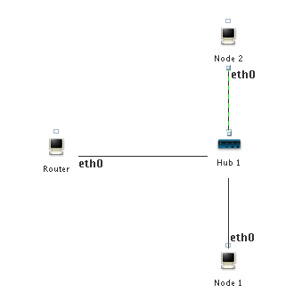

## VNE Lab: IPv4 Address Configuration and Resolution

This lab explores IPv4 static address configuration, address resolution (ARP), and auto-configuration (DHCP). The overall goal is to consolidate the basic network layer concepts and get some experience with the concepts in practice.

The technical objective of the experiments below is to configure the network with IPv4 addresses statically and automatically using the Dynamic Host Configuration Protocol (DHCP), and observe the behaviour of the ARP and ICMP protocols. DHCP can be used to configure more than just IP-addresses, but for simplicity this will not be covered in this lab.

### Step 1: Creating and Setting up the Laboratory

The same VNE laboratory is used for all the experiments and the first step is to create this laboratory using VNE:

-  Start VNE, the VNE Manager application, and create a new laboratory. Remember that spaces are not allowed in the laboratory name.

- Add three nodes and one hub. Rename the nodes to "Router", "Node 1" and "Node 2", and connect all three nodes to the hub as illustrated below:



- Save the laboratory.

- Start the laboratory. Wait until the login prompt appears for all three nodes.

- Start Wireshark. Go to the *Capture*-menu, and select *Options...*. Select the tap0-interface from the interface dropdown box. If tap0 is not in the list, close the *Capture Options*-dialog, stop the laboratory, start it again, and try again.

Make sure that the *Update list of packets in real-time*-option is checked, and press the *Start* button in the *Capture Options* dialog. All traffic sent through the hub in the laboratory will now show up in Wireshark.

### Step 2: Static IPv4 Address Configuration</h3>

1. Login to *Router* and configure it with the IPv4 address 10.0.0.1 using the command:

```
ifconfig eth0 up 10.0.0.1 netmask 255.255.0.0
```

2. Login to *Node 1*, and configure it with the IPv4 address 10.0.0.2 using the command:

```
ifconfig eth0 up 10.0.0.2 netmask 255.255.0.0
```

### Step 3: Observe ARP and Ping Packets

1. From *Router* ping *Node 1* by executing

```
ping -c 5 10.0.0.2
```

This will send 5 ping packets to *Node 1*


Identify the ARP and Ping packets captured by Wireshark. Briefly explain the flow of the ARP and Ping packets that have been sent and received as an effect of the ping-command

### Step 4: Setup DHCP Server

- On the *Router* node, edit `/etc/default/dhcp3-server` using nano (or vim if you prefer), such that the last line looks like this:

```
INTERFACES="eth0"
```
- Add the following to the end of `/etc/dhcp3/dhcpd.conf`:

```
subnet 10.0.0.0 netmask 255.255.0.0 {
    range 10.0.0.3 10.0.0.255;
}
```

This tells the DHCP server to configure the network 10.0.0.0 with the netmask 255.255.0.0 such that addresses ranging from 10.0.0.3 to 10.0.0.255 are assigned to clients.

- Start the DHCP server:

```
/etc/init.d/dhcp3-server start
```

### Step 5: Automatic IPv4 Address Configuration</h3>

- Login to *Node 2*, and run the command

```
dhclient eth0
```

This will start the DHCP client for autoconfiguration of eth0.

Identify the DHCP packets, and briefly explain the exchange of DHCP packets. What IPv4 address has been assigned to "Node 2"?

Finally, try to ping both *Node 1* and *Router*, in order to see if the network has been configured successfully.
