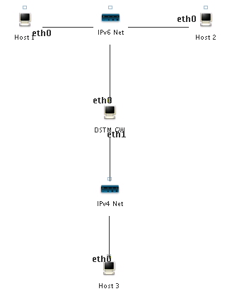

## VNE Lab: IPv6 Transition Mechanisms - DSTM

The goal of this workshop is to get hands-on experience with
IPv4-IPv6 transition mechanisms focussing on the Dual Stack Transition Mechanism (DSTM).

### Step 1: Downloading the Laboratories

Make sure that you have downloaded the precreated laboratories related to transition mechanisms as described in step 1 of the IPv6 tunneling lab:

https://github.com/lmkr/vine/blob/master/labs/ipv6tunneling/lab-tunneling.md

### Step 2: Dual Stack Transition Mode (DSTM)

The lab explore how to connect to IPv4 nodes through an
IPv6 network. For this we use the implementation of the Dual Stack Transition Mechanism provided by ENST Bretagne.

- Download the *dstm-lab* https://www.dropbox.com/s/p5906lr2dk8q237/dstm-lab.tar.bz2?dl=0 
- Open the *dstm-lab* laboratory. The topology of this laboratory is as follows:



*DSTM GW* will act as both DSTM server and border router, and also be handling the IPv6 network prefix. The laboratory comes preconfigured with IP addresses as follows:

| Network Node | eth0 (IP / netmask)       | eth1 (IP / netmask)      |
| -------------|--------------------------:|-------------------------:|
| Host 1       | 2001:878:402:2::XX / 64   | N/A                      |
| Host 2       | 2001:878:402:2::XX / 64   | N/A                      |
| Host 3       | 10.0.0.10 / 255.255.255.0 | N/A                      |
| DSTM GW      | 2001:878:402:2::1 / 64    | 10.0.0.1 / 255.255.255.0 |
| Router 2     | 10.0.0.2 / 255.255.255.0  | 10.0.0.1 / 255.255.255.0 |

An `XX` in an IPv6 address means that the interface is configured using stateless autoconfiguration and will receive an address with the prefix given to the corresponding router.

- Start the laboratory

- In order to familarise yourself with the IP addresses assigned (especially those autoconfigured), ping *Host 2* from *Host 1*, and *Host 3* from *DSTM GW*.

**Question:** From *Host 1* ping *Host 3*, this should not work, why not?

Step 3: Configuring the DSTM server/gateway

We start by setting up the DSTM server/gateway. In the DSTM implementation used both the server and the gateway functionality is implemented in the daemon program named `rpcdstmd`.

- On the *DSTM GW*, create `/etc/rpcdstmd.args` with the following content:

 ```
tsp=3545
authmode=anonymous
```

- Create `/etc/rpcdstmd.conf` with the following content:

```
default-lease-time 900;
tep6 2001:878:402:2::1;
tep4 10.0.0.1;

subnet 10.0.1.0 netmask 255.255.255.0 {
range 10.0.1.1 10.0.1.200;
}
```

- Start the rpcdstmd daemon by running `/etc/init.d/rpcdstmd start`

- On *Host 1*, create `/etc/dstmd.args` with the following content:

 ```
tspserver=2001:878:402:2::1
port=3545
authmode=anonymous
```

Start the DSTM daemon by running `/etc/init.d/dstmd start`. The logfile `/var/log/dstmd.log` will be used by the DSTM daemon to log information which can be useful for debugging purposes in case problems arise.

### Step 4: Inspecting Tunneled Packets

- Use Wireshark to capture packets from the IPv6 network.

- From *Host 1* ping *Host 3*, this time it should work.

**Question:** Type `ifconfig` in order to see all interfaces configured on *Host 1*.

You will notice a new interface called `dti0`, what do you think the purpose of this interface is? (hint: check the IP
address it is configured with)

- Stop capturing packets with Wireshark, and inspect them.

**Question:** You will notice a number of TCP packets sent between *Host 1* and *DSTM GW*. Right click on one of them and choose *Follow TCP Stream*.

You will now get the raw contents of the communication. Red lines are messages sent by *Host 1*, blue lines are messages sent by *DSTM GW*. Briefly explain what the protocol does.

**Question:** Close the TCP Stream window, and clear the contents of the Filter text-field by pressing the *Clear* button in Wireshark. Explain how the IPv4 ping packets are sent over the IPv6 network.

- Setup the DSTM daemon on *Host 2*, and try to ping *Host 3* from *Host 2*.

**Question:** What IPv4 address is assigned to *Host 2*? How did you find out?

### References

[DSTM Website](http://www.ipv6.rennes.enst-bretagne.fr/dstm/">http://www.ipv6.rennes.enst-bretagne.fr/dstm/)
