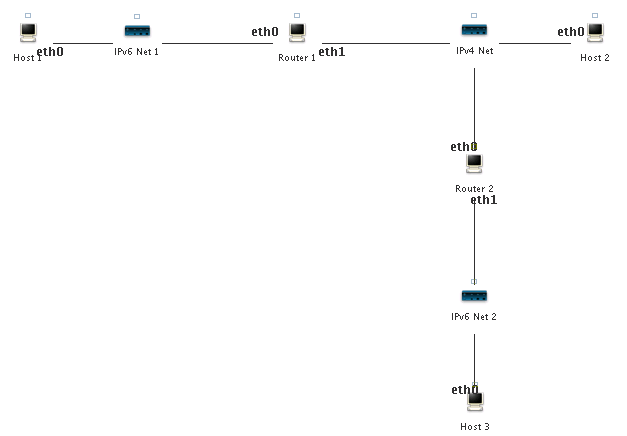

## VNE Lab: IPv6 Transition Mechanisms - Tunneling

The goal of this workshop is to get hands-on experience with
IPv4-IPv6 transition mechanisms focussing on IPv6-in-IPv4 tunnelling,

### Step 1: Downloading the Laboratories

The exercise is based on a precreated laboratory that must downloaded. The laboratory is preconfigured with topology and IP addresses

The precreated laboratories can be downloaded using the following steps:

- Start VNE

- In VNE, press ALT-F2 in order to bring up the *Execute Program*-dialog. Type in *firefox*, and wait for it to start.

- Point FireFox to https://www.dropbox.com/s/8oqrhqc9emqvesu/simple-tunnel-lab.tar.bz2-lab.tar.bz2?dl=0 by typing it in the location bar. When asked what to do with the file, choose *Save As*. The file will now be saved to the desktop.

- When FireFox has finished downloading, close both FireFox windows.

- Locate the `transition-workshop.tar.bz2` file on the desktop and right-click it. Select *Extract to...*. A dialog will popup. Type in `/root/labs` in the *Extract to:*-field, and press the *Extract*-button. The process will start, and once finished the window will close.

### Step 2: Simple Tunnel Setup

We first consider the process of setting up a single IPv6-in-IPv4 tunnel. The IPv6-in-IPv4 tunnel allows connections to IPv6 networks through IPv4 networks. This is what is used when connecting to the [Hexago network](www.hexago.com) or other IPv6 networks through the Internet.            

- Start the VNE Manager and load the *simple-tunnel-lab* laboratory. The topology of the laboratory is as follows:



- Start the laboratory, and wait until all nodes have started up completely. The laboratory is preconfigured with the following IP addresses:<br><br>

| Network Node | eth0 (IP / netmask)       | eth1 (IP / netmask)      |
| -------------|--------------------------:|-------------------------:|
| Host 1       | 2001:878:402:1:XX / 64    | N/A                      |
| Host 2       | 10.0.0.3 / 255.255.255.0  | N/A                      |
| Host 3       | 2001:878:402:2:XX / 64    | N/A                      |
| Router 1     | 2001:878:402:1::1 / 64    | 10.0.0.1 / 255.255.255.0 |
| Router 2     | 10.0.0.2 / 255.255.255.0  | 2001:878:402:2::1 / 64   |

An `XX` in an IPv6 address means that the interface is configured using stateless autoconfiguration and will configure an address with the prefix given to the router on the corresponding network.

Try to ping *Router 1*(eth0) from *Host 1*, *Router 1*(eth1) from *Host 2*, and *Router 2*(eth1) from *Host 3*. This should work without any problems.

**Question:** Try to ping eth1 of *Router 1* from *Host 1*, why is this not possible?

### Step 3: Configuring the tunnel

Now, we setup a 6-in-4 tunnel between *Router 1* and *Router 2*, such that *Host 1* and *Host 3* can communicate using IPv6.

- Login to *Router 1* and execute the following command:

 ```
iptunnel add tun0 mode sit ttl 64 remote 10.0.0.2 local 10.0.0.1
```

 This will create a virtual network interface called `tun0`. The tunnel uses `sit` mode, which stands for Simple Internet Transition. Packets sent to the interface are encapsulated in IPv4 packets and send to the remote endpoint (10.0.0.2). IPv4 packets containing IPv6 packets received on the local endpoint (10.0.0.1) are decapsulated and delivered through
the tunnel interface. The `ttl 64` specifies that the TTL of the generated IPv4
packets is to be set to 64.

- Setup an IPv6 address on the <tt>tun0</tt> interface:

 ```
ifconfig tun0 up
ifconfig tun0 add 2001:878:402:3::1/64
```

 Note that we are using a new network prefix rather than one of the two already used. This makes the interface easier to use, as all packets for the `2001:878:402:3/64` prefix are automatically routed to the `tun0` interface.

- Login to *Router 2* and create the other endpoint of the tunnel:

 ```
iptunnel add tun0 mode sit ttl 64 remote 10.0.0.1 local 10.0.0.2
ifconfig tun0 up
ifconfig tun0 add 2001:878:402:3::2/64
```

- Ensure that you can ping `2001:878:402:3::1` from *Router 2*.

**Question:** Currently, it is not possible to ping `2001:878:402:1::1` from *Router 2*. Briefly explain why.

- On *Router 1* add a route to the `2001:878:402:2/64` network by running:

 ```
route -6 add 2001:878:402:2::/64 gw 2001:878:402:3::2
```

- On *Router 2* add a route to the `2001:878:402:1/64` network:

 ```
route -6 add 2001:878:402:1::/64 gw 2001:878:402:3::1
```

- Ensure that you can ping `2001:878:402:1::1` from both *Router 2* and *Host 3*.

- Use the command `route -6` to inspect the routing tables on *Router 1* and *Router 2*, and observe how the tunnel endpoints are being used as interfaces.

- Start *Wireshark*, and capture packets from IPv4 Net. Ping *Host 3* from *Host 1*.

- After a couple of ping requests have been answered, stop the ping and Wireshark capture.

- Inspect the ping packets captured.

**Question:** Briefly explain the structure of the ping packets captured.
- Stop the laboratory.
