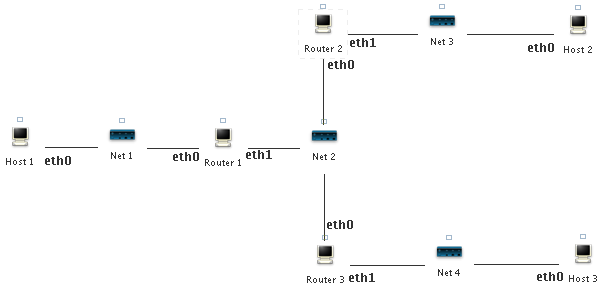

## VNE Lab: Static Routing

This lab explores how how routing can be setup statically in an IP network. We will only be using IPv4 in this workshop as the IPv4 addresses are shorter and hence easier to deal with. The basic concepts are the
same for IPv6 networks.</p>

### Step 1: Downloading the Laboratory</h2>

A precreated laboratory will serve as a base for all
the experiments The topology of the laboratory is as follows:



The laboratory can imported into VNE by the following
steps: IS THE LAB ALREADY INSIDE VINE? OTHERWISE IT NEED TO BEMADE AVAILABLE SOMEWHERE ELSE

- Start VNE.

- In VNE, press ALT-F2 in order to bring up the *Execute
program*-dialog. Type in *firefox*, and wait for it to start.

- Point FireFox to http://www.daimi.au.dk/NPaI/routing-workshop.tar.bz2 by typing it in the location bar. When asked what to do with the file, choose *Save As*. The file will now be saved to the desktop.

- When FireFox is finished downloading, close both FireFox
windows.

- Locate the `routing-excercise.tar.bz2` file in the
desktop, and right-click it. Select *Extract To...*.

- A dialog will popup. Type in `/root/labs` in the *Extract to:*-field, and press the *Extract*-button. The process will start, and once finished the window will close.

### Step 2: Setting up the Laboratory</h2>

The network nodes in the laboratory are to be configured with static IPv4 addresses that are retained between laboratory restarts as explained in the following.

- Start the VNE Manager application and open the routing laboratory that was downloaded in the previous step.

- Start the laboratory and wait for all network nodes to startup (showing the login-prompt)</li>

- The IP addresses of all network nodes are to be configured according to the following address allocation for the four networks (Net 1, Net 2, Net 3, and Net 4):

| Hub        | Network address | Network mask|
| -----------|----------------:|------------:|
| Net 1      | 10.1.0.0        | 255.255.0.0 |
| Net 2      | 10.2.0.0        | 255.255.0.0 |
| Net 3      | 10.3.0.0        | 255.255.0.0 |
| Net 4      | 10.4.0.0        | 255.255.0.0 |


The allocation of the IP addresses to the interfaces of each node is as follows:

| Node name  | eth0 address | eth0 netmask | eth1 address | eth1 netmask |
| -----------|-------------:|-------------:|-------------:|-------------:|
| Host 1     | 10.1.0.2     | 255.255.0.0  | N/A          | N/A          |
| Host 2     | 10.3.0.2     | 255.255.0.0  | N/A          | N/A          |
| Host 3     | 10.4.0.2     | 255.255.0.0  | N/A          | N/A          |  
| Router 1   | 10.1.0.1     | 255.255.0.0  | 10.2.0.1     | 255.255.0.0  |          
| Router 2   | 10.2.0.2     | 255.255.0.0  | 10.3.0.1     | 255.255.0.0  |          
| Router 3   | 10.2.0.3     | 255.255.0.0  | 10.4.0.1     | 255.255.0.0  |


The IP address configuration is made persistent between laboratory shutdowns by adding the configuration lines to `/etc/init.d/network` which will be loaded during startup.

- Login to "Host 1", and add the following to the end of `/etc/init.d/network:`

  ```
  ifconfig eth0 up 10.1.0.2 netmask 255.255.0.0
  ```

  This will configure `eth0` of Host 1 with the IP address `10.1.0.2` and the netmask `255.255.0.0`. The configuration will not be effectively immediately, run `/etc/init.d/network` to activate the configuration.

- Configure the two other hosts as done in the previous step, using the correct address according to the IP address allocation table. The routers will be configured in the next step. Remember to run `/etc/init.d/network` in order to activate the IP configuration.


- The routers are configured by adding three lines to `/etc/init.d/network`. This amounts to one for each interface, and one
    to enable IP packet forwarding. Login to "Router 1" and add
    the following to `/etc/init.d/network`:

    ```
    ifconfig eth0 up 10.1.0.1 netmask 255.255.0.0
    ifconfig eth1 up 10.2.0.1 netmask 255.255.0.0
    echo 1 > /proc/sys/net/ipv4/ip_forward
    ```

    Remember to run `/etc/init.d/network` in order to
    activate the IP configuration.

- Configure the remaining two routers in the same manner as
    *Router 1* was configured, using the IP addresses from the IP
    address allocation table. Remember to run
    `/etc/init.d/network` in order to activate the IP
    configuration.

- Test that "Host 1" can ping eth0 (10.1.0.1) of *Router 1*. On "Host 1" run:

 ```
route
 ```

 this will show the routing table of the host.

**Question:** Use the output from route to explain why *Host 1* cannot ping eth1 (10.2.0.1) of *Router 1*.

**Question:** Which nodes can ping each other, and which cannot? Explain why this is so (the output of the route command on each node might help you).

### Step 3: Static Routing</h2>

Having set up the laboratory and seen that the current routing information is not enough, we will add the missing routes manually, such that all nodes can communicate with each other.

- On *Host 1* add *Router 1* as default router (gateway) using the following command:

 ```
 route add default gw 10.1.0.1
 ```
- From *Host 1* ping eth1 (10.2.0.1) of *Router 1* (this should now work).

**Question:** Which IP addresses can "Host 1" reach, i.e., receive a ping-reply from? Explain why.

**Question:** For the same reasons as *Host 1* could not ping eth1 of *Router 1* before we added a default route, *Router 1* cannot reach eth1 of *Router 2*. Is it reasonable to solve this problem by adding a default gateway?

In order for *Router 1* to be able to communicate with eth1 of *Router 2*, we need to setup a route to the network `10.3.0.0` with netmask `255.255.0.0`. This is done by entering the following on the command line of *Router 1*:

```
route add -net 10.3.0.0 netmask 255.255.0.0 gw 10.2.0.2
```

  This tells the routing system, that network `10.3.0.0` (with netmask `255.255.0.0`) is available via the IP address `10.2.0.2`.

**Question:** Run the route command on *Router 1*, and explain the contents of the routing table.

**Question:** What changes are to be made to the routing tables of the remaining network nodes, before all nodes can communicate with each other? Try it out.
